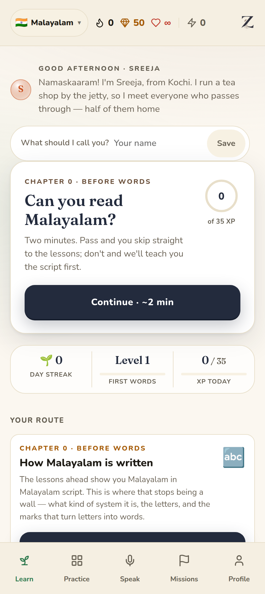

# v99 — Chapter 0: the app stops assuming you can read

The app had a good script course. A primer on what kind of writing system this
is, letter groups with the sound each one makes, vowel signs for the abugidas,
joined forms built live with ZWJ for the Arabic scripts, Hangul block assembly,
confusable pairs with the tell that separates them.

It was a **tile in "more ways to practise"**, below the fold, next to flashcards.

Meanwhile the route — the thing a learner actually follows — opened on
*Introductions*, and handed them ഞാൻ.

For a heritage learner that assumption is often exactly backwards. They can
follow their grandmother on the phone and cannot read a word of it. Giving that
person ഞാൻ and moving on isn't a course, it's a wall with a greeting written on
it — and the part of the app that would have helped was three scrolls down,
looking optional.

## Chapter 0 is now the first thing on the route

Ahead of introductions, because the writing system comes before the words. Six
steps in Malayalam, seven in Korean, four in Arabic — built from the pack's own
data, so a language that has letters gets a chapter and one that doesn't
doesn't. Every step deep-links into its own lesson instead of dropping you back
at the menu you just chose from.

**Eight languages show none of this.** A Spanish learner can already read
"hola"; a collapsed "Chapter 0 (not applicable)" row would be worse than absent.
The gate is `pack.alphabet`, not a hand-kept list.

## And the way out is the first thing you see

> **Already read it? Take the 2-minute test →**

Someone who has read Urdu since childhood must not have to scroll past six
letter lessons to be allowed to learn a word. The exam is the top button in the
chapter and the hero action on Home for the first two lessons; pass it and
Chapter 0 collapses to a single line — *"Chapter 0 — you can read Urdu"* — that
stays on the route, because "I did that" is information.

After two lessons it stops asking. A learner who has decided to muddle through
with romanisation is allowed to, and the chapter waits for them.

## What the exam asks

Not "name this letter". Naming letters is a party trick a reader never performs
and a non-reader can be drilled into. It asks the two questions a reader answers
without thinking:

| | |
|---|---|
| **What does this say?** | سڑک → `sarak` · `madad` · `roti` · `aur` |
| **What does it mean?** | മീൻ → *fish* · *very thirsty* · *okay* · … |

plus letter → sound and sound → letter, because recognising ക when shown it is a
much weaker skill than producing it when asked for "ka".

**The wrong answers are the whole design.** A multiple-choice reading question
with random distractors can be answered by elimination — pick the one that isn't
the wrong shape, the wrong length, the wrong script — without reading anything.
So distractors come from the same script, the same length band where possible,
and for letters from that letter's own **confusable set** when the pack declares
one: ത vs ട, ن vs ت. Those are exactly the pairs a non-reader cannot separate.

Twelve questions, 80% to pass. Guessing gets through fewer than **1 in 1,000**
times — measured, not asserted.

## Two things the checks caught before anyone saw them

**Chinese was going to be asked to name letters.** The `zh` pack's "alphabet" is
`b p m f` — the pinyin initials, because Chinese has no alphabet. That is correct
data and would have made a nonsense exam: four Latin letters on screen, testing
nothing about reading 漢字. Chinese now gets no letter questions at all; the
whole paper is 字 → sound → meaning, which is the reading skill in question.

**Papers were coming out eleven questions long.** Malayalam and Tamil each name
two different letters "oo"; Japanese has nine words sharing a romanisation.
Those questions get dropped (a three-option question is a free 33% guess), and
the paper quietly shrank — which also quietly moved its own pass mark, since the
bar is a share of however many questions were asked. Candidates are
over-generated now and the paper is composed to a fixed shape.

Neither is visible in one draw. `test-script-exam.mjs` builds **200 papers per
language** for that reason: a property that holds for one deal is not a property.

## Verified

- `npm run validate-script-course` — Chapter 0 offered in 11 of 19; every stop
  opens onto a real lesson; every exam can be built. 0 errors
- `npm run test-script-exam` — 7 properties over 200 papers × 11 languages.
  Proven capable of failing: drawing the "what does this say" distractors from
  the native script instead of the romanisations produces
  `[مساعدة | bi-khayr | السماء | مباشرة]` — a question answerable without
  reading — and the suite reports it
- `npm run verify-chapter-zero` — **all 19 languages in a real browser**, 11
  reading tests sat end to end. Proven capable of failing: a build with the
  route component switched off reports *"Chapter 0 is missing from the route"*
  for exactly the languages that should have it
- `npm run check` — every validator, audit and build, exit 0
